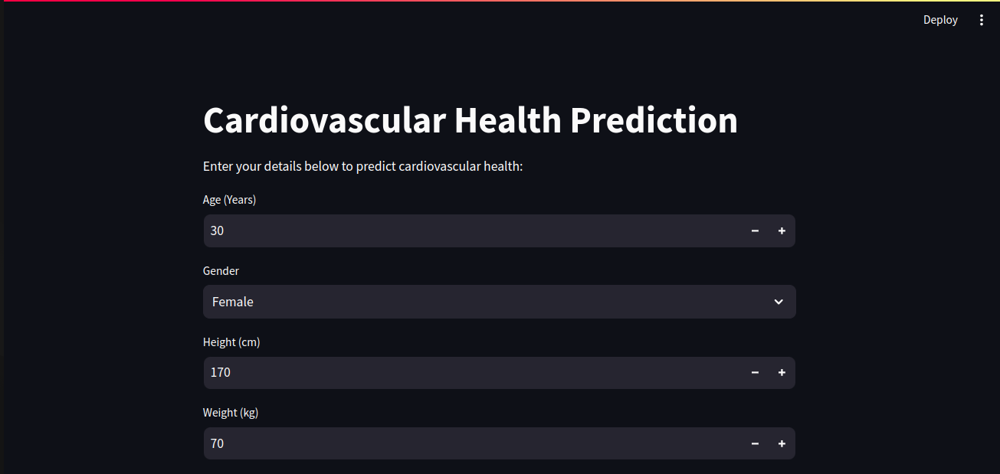
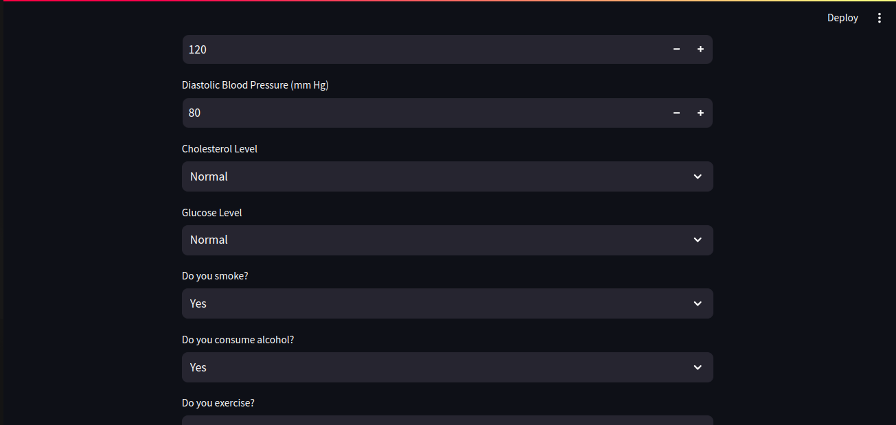
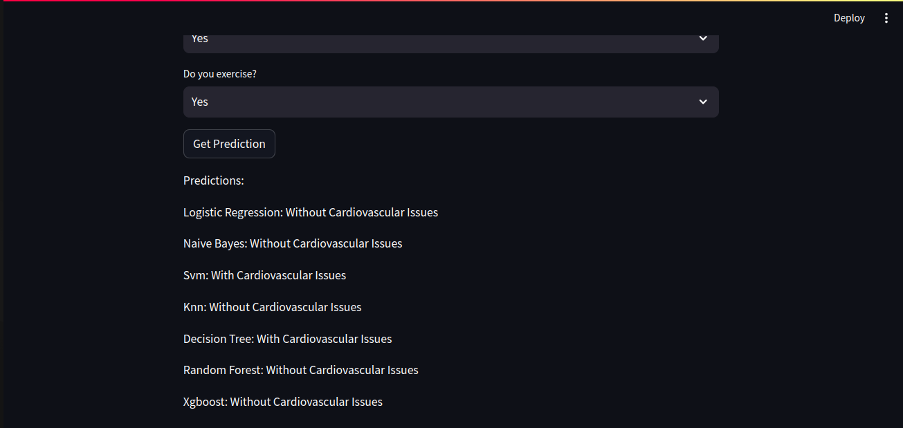
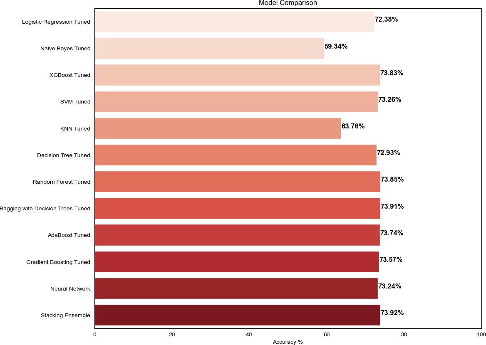

# Heart Health Predictor: A Study on Cardiovascular Disease Risk and Prevention
## DEPI FINAL PROJECT
BY
- Ahmed Khalid
- Abonoub Yousry
  
  -----------------------------------------------------------------------------------------------
  
  
  

---------------------------------------------------------------------------------------------------
## 1) Abstract 
 - This project aims to develop and evaluate machine learning models for predicting cardiovascular disease using a dataset containing various health-related features. The study employs a diverse set of algorithms, including logistic regression, naive Bayes, support vector machines, decision trees, random forests, AdaBoost, gradient boosting, bagging, neural networks, and a stacking ensemble. The project also incorporates exploratory data analysis (EDA) and visualizations to better understand the dataset. The final models are compared, and their performances are analyzed, highlighting the significance and potential implications of the findings.
## 2) Introduction
 - Cardiovascular diseases (CVDs) continue to be a leading cause of global morbidity and mortality, necessitating innovative approaches for early detection and prevention. Machine learning, with its ability to analyze complex relationships within datasets, offers a promising avenue for predicting cardiovascular diseases. This project aims to develop accurate and reliable models for the early identification of individuals at risk of cardiovascular diseases.

## 3) Objectives
- Model Development: Develop and evaluate machine learning models for predicting cardiovascular diseases based on relevant health-related features.
- Feature Importance Analysis: Identify key predictors contributing to cardiovascular disease prediction, providing insights into the underlying risk factors.
- Comparative Analysis: Compare the performance of diverse machine learning algorithms to determine the most effective models for cardiovascular disease prediction.
## 4) Methodology
 - The methodology section outlines the systematic approach taken to conduct the research, encompassing data preparation, exploratory data analysis (EDA), feature scaling, model selection, hyperparameter tuning, and evaluation metrics.
   - Data Collection and Preprocessing
   - Exploratory Data Analysis (EDA)
   - Feature Scaling
   - Train-Test Split
   - Model Selection
## 5) Model Evaluation
A custom function, evaluate_model, is designed to fit the models on the training data, predict on the test set, and output relevant evaluation metrics. Metrics include accuracy, confusion matrix, and classification report. The models' performance is then compared based on accuracy scores.
  

